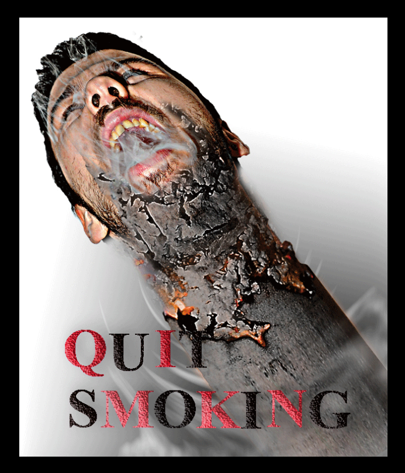
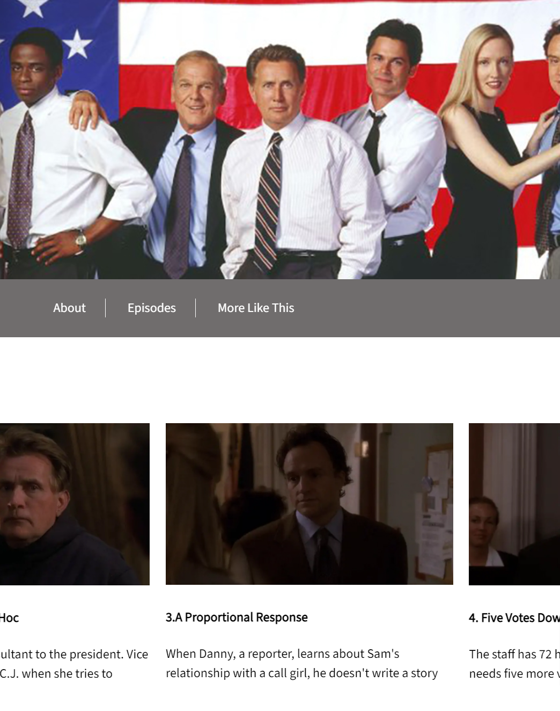
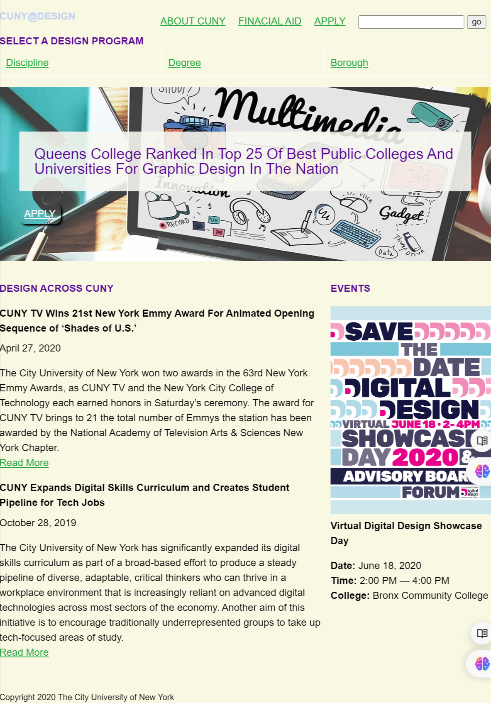

---
title: Html Page
layout: base
pageClass: projects
tags:
  - work
--- 
<h1>HTML  &#38; CSS</h1>
<section class="HTML">

<a href="HTMLcss/quitSmoking/smoking/index.html">
    

        
        <h2>Quit smoking - 2017</h2>
    

</a>

This website persuades people to stay away from cigarettes by introducing people to the
    reasons for quitting smoking, the harms of smoking the benefits of quitting smoking and
    the steps to quit smoking. I put an animation that I made with After Effects at the home page.

    <a href="HTMLcss/episode/index.html">
        

            
            <h2>TV series website - 2023</h2>

    </a>
    
I used HTML & CSS to create a two-page website with general information about
        “The West Wing” TV series as well as an episode index. This project allowed me 
        to explore the use of many CSS properties, including float, display, flex,
        background and max-width.

    

    

        <a href="HTMLcss/cunyDesign/index.html">
            

                
                <h2>CUNY design majors website  - 2023</h2>
            

        </a>
        
This is a responsive website helps prospective students find a design or animation program
            in a CUNY college. The site supports different viewport sizes with two breakpoints for 
            computer and mobile.

    

</section>

                  