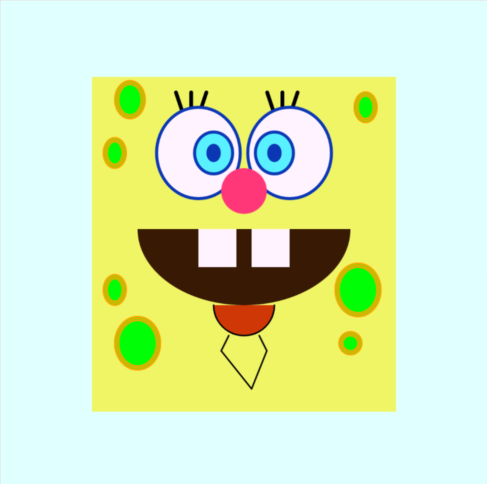
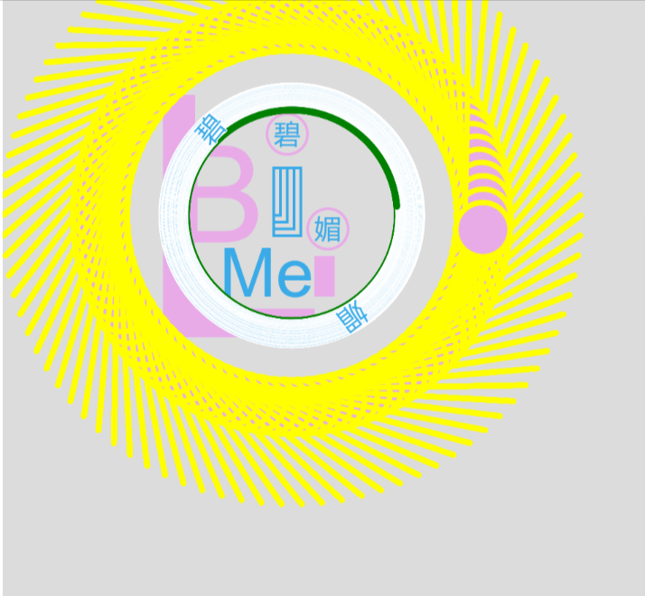

---
title: Javascript Page
layout: base
pageClass: projects
tags:
  - work
     <h1>JavaScript</h1>
          <section class="JavaScript">
          

          <a href="JS/spongebob/index.html">
              

                  
                  <h2>Spongebob - 2017</h2>
              

          </a>
          

          

            <a href="JS/animation/index.html">
              

                  
                  <h2>Animation - 2017</h2>
              

          </a>
          

          </section>
        